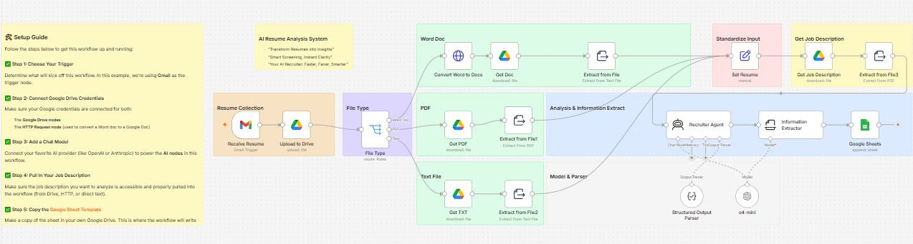

# 📄 AI Resume Analyzer System using n8n, OpenAI, Google Drive & Google Sheets


---

# 📖 Overview

The **AI Resume Analyzer System** automates the initial candidate screening process for recruiters and HR teams.

Instead of manually reviewing every resume, this workflow automatically receives resumes via Gmail, uploads them to Google Drive, detects the file type, extracts the resume text, retrieves the target Job Description, and sends both documents to an AI Recruiter Agent powered by OpenAI.

The AI analyzes technical skills, experience, education, strengths, weaknesses, ATS compatibility, and overall candidate suitability. Finally, the structured evaluation is saved into Google Sheets for easy filtering, reporting, and recruitment decision-making.

This significantly reduces manual effort while ensuring faster and more consistent candidate screening.

---

# 🖼️ Workflow Layout



---

# ✨ Features

* 📩 Automatic resume collection from Gmail
* ☁️ Upload resumes to Google Drive
* 📄 Support for PDF, DOCX, and TXT resumes
* 📝 Automatic text extraction
* 📋 Job Description comparison
* 🤖 AI-powered Recruiter Agent
* 📊 Candidate scoring and evaluation
* 🧠 Structured AI output parser
* 📈 ATS-style resume analysis
* 📄 Google Sheets reporting
* ⚡ Multi-format resume support
* 🚀 Fully automated recruitment workflow

---

# 💼 Business Problem Solved

Recruiters often spend significant time manually reviewing resumes before identifying qualified candidates.

This process becomes increasingly difficult when hundreds of applications are received for a single position.

The AI Resume Analyzer automates this process by extracting resume content, comparing it with a target job description, and producing standardized candidate evaluations.

HR teams receive structured reports instead of reading every resume manually, allowing them to shortlist candidates much faster while maintaining consistency across evaluations.

---

# 🛠 Technologies Used

| Technology               | Purpose                  |
| ------------------------ | ------------------------ |
| n8n                      | Workflow automation      |
| Gmail Trigger            | Resume collection        |
| Google Drive             | Resume storage           |
| Google Docs              | Word document conversion |
| File Extract Node        | Text extraction          |
| OpenAI GPT-4o Mini       | Candidate analysis       |
| Structured Output Parser | JSON parsing             |
| Google Sheets            | Recruitment report       |
| JavaScript               | Data transformation      |

---

# 🔧 Prerequisites

Before importing the workflow, ensure you have:

* Latest version of n8n
* OpenAI API Key
* Google Drive OAuth Credentials
* Google Sheets OAuth Credentials
* Gmail OAuth Credentials
* Google Docs API enabled

---

# 🔐 Required Credentials

## 📧 Gmail

### Required

* Gmail OAuth2

### Used For

* Receive incoming resumes
* Monitor recruitment inbox

---

## ☁️ Google Drive

### Required

* OAuth2 Credentials

### Used For

* Upload candidate resumes
* Store recruitment files

---

## 📄 Google Docs

### Required

* Google Docs API

### Used For

* Convert DOCX files
* Extract readable text

---

## 🤖 OpenAI

### Required

* OpenAI API Key

### Used For

* Resume evaluation
* Job description comparison
* Candidate scoring
* ATS analysis

---

## 📊 Google Sheets

### Required

* OAuth2 Credentials

### Used For

* Save recruitment reports
* Candidate database
* Screening dashboard

---

# 🚀 Installation

## 1️⃣ Import Workflow

Import the `AI_Resume_Analysis_System.json` file into n8n.

---

## 2️⃣ Configure Gmail

Authorize Gmail Trigger credentials.

---

## 3️⃣ Configure Google Drive

Connect Google Drive OAuth credentials.

---

## 4️⃣ Configure Google Docs

Enable Google Docs API.

---

## 5️⃣ Configure Google Sheets

Authorize Google Sheets credentials.

---

## 6️⃣ Configure OpenAI

Create OpenAI credentials and connect them to the AI Recruiter Agent.

---

## 7️⃣ Update Job Description

Upload or specify the Job Description document that will be used during candidate evaluation.

---

## 8️⃣ Activate Workflow

Enable the workflow to automatically process incoming resumes.

---

# 📥 Supported Resume Formats

| Format | Supported |
| ------ | --------- |
| PDF    | ✅         |
| DOCX   | ✅         |
| TXT    | ✅         |

---

# 📩 Example Resume Email

**Subject**

```text
Application for Software Engineer Position
```

**Attachment**

```text
John_Doe_Resume.pdf
```

**Body**

```text
Hello Recruiter,

Please find my resume attached for the Software Engineer position.

Thank you.

John Doe
```
# 📚 Node-by-Node Documentation

This section explains every node used in the AI Resume Analyzer System, its purpose, configuration, expected input, and generated output.

---

# 1️⃣ 📧 Receive Resume (Gmail Trigger)

**Node Type:** Gmail Trigger

## 🎯 Purpose

Monitors a Gmail inbox for new incoming job applications and automatically starts the workflow whenever a resume email is received.

---

### ⚙️ Configuration

| Parameter | Value     |
| --------- | --------- |
| Resource  | Message   |
| Operation | Trigger   |
| Folder    | Inbox     |
| Polling   | Automatic |

---

### 📥 Expected Input

* Resume attachment
* Candidate email
* Email subject
* Email body

---

### 📤 Example Output

```json
{
  "subject":"Application for Backend Developer",
  "from":"john.doe@gmail.com",
  "attachment":"John_Doe_Resume.pdf"
}
```

---

# 2️⃣ ☁️ Upload to Google Drive

**Node Type:** Google Drive

## 🎯 Purpose

Uploads the received resume to Google Drive so it can be processed regardless of its original format.

---

### Configuration

| Parameter | Value             |
| --------- | ----------------- |
| Operation | Upload File       |
| Folder    | Resume Collection |

---

### Output

```json
{
   "fileId":"1AbCdEf12345",
   "fileName":"John_Doe_Resume.pdf"
}
```

---

# 3️⃣ 📂 File Type

**Node Type:** Switch / File Type

## 🎯 Purpose

Detects the uploaded resume format and routes it through the correct extraction process.

---

### Supported Types

* 📄 PDF
* 📝 DOCX
* 📃 TXT

---

### Output

Routes the workflow into:

* PDF Branch
* Word Branch
* Text Branch

---

# 4️⃣ 📝 Word Document Branch

### 📄 Convert Word to Google Docs

**Node Type:** Google Drive

Purpose:

Converts DOCX into Google Docs format for easier text extraction.

---

### 📄 Get Document

Downloads the converted Google Document.

---

### 📄 Extract From File

Extracts plain text from the converted document.

---

### Output Example

```text
John Doe

Software Engineer

Experience

5 years in Java and Python

Education

B.E Computer Engineering
```

---

# 5️⃣ 📄 PDF Branch

### Google Drive

Downloads the uploaded PDF resume.

---

### Extract From PDF

Uses the Extract From File node to retrieve readable text from the PDF document.

---

### Output Example

```text
Technical Skills

Python

Java

React

AWS

Docker
```

---

# 6️⃣ 📃 TXT Branch

Downloads the uploaded TXT file and extracts its contents.

Useful for resumes exported as plain text.

---

# 7️⃣ 📋 Set Resume

**Node Type:** Set

## 🎯 Purpose

Standardizes resume content from all three branches into a common JSON structure.

Regardless of the uploaded file type, the Recruiter Agent always receives the same input format.

---

### Example

```json
{
  "resume":"Complete extracted resume text..."
}
```

---

# 8️⃣ 📄 Get Job Description

**Node Type:** Google Drive

Downloads the predefined Job Description document.

---

### Parameters

| Parameter | Value           |
| --------- | --------------- |
| Operation | Download        |
| File      | Job Description |

---

# 9️⃣ 📑 Extract Job Description

Extracts readable text from the Job Description document.

---

### Example Output

```text
Required Skills

Python

SQL

REST APIs

Communication Skills

Experience

2+ Years
```

---

# 🔟 🤖 Recruiter Agent

**Node Type:** AI Agent

## 🎯 Purpose

Acts as an AI Technical Recruiter.

The agent compares the extracted resume against the supplied Job Description and generates a detailed candidate evaluation.

---

### Connected Nodes

* OpenAI Chat Model
* Structured Output Parser

---

### Responsibilities

* Resume parsing
* Skills matching
* Experience evaluation
* ATS compatibility
* Candidate scoring
* Hiring recommendation

---

### Example Prompt

```text
Compare the candidate resume against the provided job description.

Evaluate:

Technical Skills

Experience

Education

Projects

Strengths

Weaknesses

ATS Compatibility

Overall Recommendation

Return structured JSON.
```

---

# 1️⃣1️⃣ 🧠 OpenAI Chat Model

**Node Type:** OpenAI Chat Model

## Purpose

Provides reasoning and generates the complete recruitment analysis.

---

### Configuration

| Parameter   | Value       |
| ----------- | ----------- |
| Model       | GPT-4o Mini |
| Temperature | 0.2         |

---

### Used For

* Resume analysis
* Candidate scoring
* Recommendation generation

---

# 1️⃣2️⃣ 📑 Structured Output Parser

## Purpose

Ensures AI responses follow a predefined JSON structure instead of plain text.

---

### Benefits

* Consistent outputs
* Easy reporting
* Google Sheets compatibility
* API-friendly responses

---

# 1️⃣3️⃣ 📊 Information Extractor

## Purpose

Extracts only the required recruitment fields from the AI response.

---

### Example Fields

* Candidate Name
* Skills
* Experience
* Education
* Match Score
* Recommendation

---

# 1️⃣4️⃣ 📄 Google Sheets

**Node Type:** Google Sheets

## Purpose

Stores structured recruitment reports for HR teams.

---

### Operation

Append Row

---

### Suggested Columns

| Column         |
| -------------- |
| Timestamp      |
| Candidate Name |
| Email          |
| Skills         |
| Experience     |
| Education      |
| ATS Score      |
| Match Score    |
| Strengths      |
| Weaknesses     |
| Recommendation |
| Resume File    |

---

# 🌍 Use Cases

* 👨‍💼 HR Recruitment Automation
* 📄 Resume Screening
* 🎯 ATS Resume Evaluation
* 🏢 Corporate Hiring
* 💼 Recruitment Agencies
* 🎓 University Placement Cells
* 🚀 Startup Hiring
* 👨‍💻 Technical Candidate Evaluation

---

# 🎯 Benefits

* ⚡ Faster resume screening
* 🤖 AI-powered recruiter assistance
* 📊 Standardized candidate evaluation
* 📈 Higher recruitment efficiency
* 📄 Automatic reporting
* ☁️ Multi-format resume support
* 📋 Structured hiring decisions
* 💰 Reduced manual effort

---

# 🛠️ Customization Ideas

* 📧 Automatic interview invitation emails
* 📅 Google Calendar interview scheduling
* 💬 Slack or Microsoft Teams notifications
* 🏷️ Candidate ranking dashboard
* 🌍 Multi-language resume support
* 📊 Power BI recruitment analytics
* 🧠 Custom scoring criteria
* 🔗 ATS or HRMS integration

---

# ⚠️ Troubleshooting

| Problem                    | Cause                           | Solution                                           |
| -------------------------- | ------------------------------- | -------------------------------------------------- |
| Resume text not extracted  | Unsupported or scanned PDF      | Use searchable PDFs or OCR before processing       |
| Google Drive upload fails  | OAuth expired                   | Reconnect Google Drive credentials                 |
| AI response is incomplete  | Prompt too short or token limit | Increase max tokens and refine the prompt          |
| Google Sheets append fails | Incorrect Spreadsheet ID        | Verify spreadsheet configuration                   |
| Job Description missing    | Invalid Drive file              | Check the file ID and sharing permissions          |
| Workflow not triggered     | Gmail Trigger inactive          | Activate the workflow and verify Gmail credentials |

---

# 🚀 Future Improvements

* 📊 Resume ranking leaderboard
* 🧠 Semantic candidate matching with vector databases
* 🎯 Multi-job description comparison
* 🌍 Multi-language resume analysis
* 📧 Automated interview invitations
* 📅 Calendar integration for interview scheduling
* 📈 Recruitment analytics dashboard
* 🔗 Integration with ATS and HRMS platforms

---

# 🤝 Contributing

Contributions, feature requests, and improvements are welcome. Feel free to fork the repository, submit pull requests, or open issues to enhance the workflow.

---

# ⭐ Support

If this workflow helped you, consider giving the repository a **⭐ Star** on GitHub. Your support helps others discover useful n8n automation projects and encourages further development.

